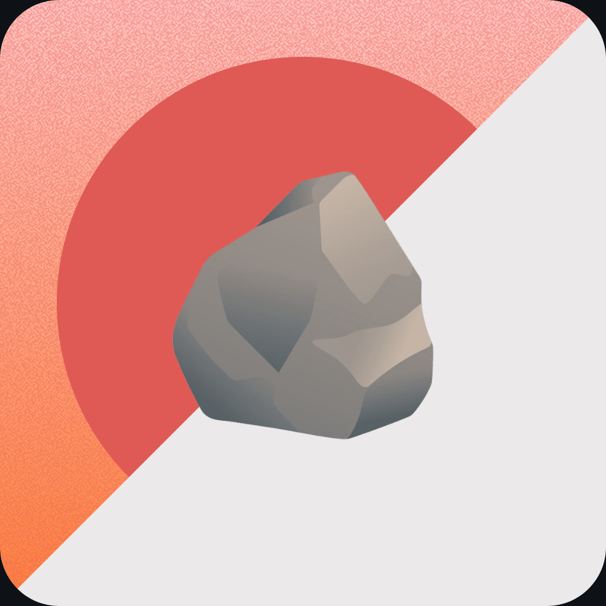

<section align="center">
  
  <h1>I Am Poor</h1>
  
02 | <em>An Xcode Storyboard and Interface Builder Challenge</em>

</section>

---

## Project Overview

This project is an extension of the [I Am Rich](#) app, part of Dr. Angela Yu's **Complete iOS App Development Bootcamp**. The goal is to apply the concepts from the Xcode Storyboard and Interface Builder unit to recreate and refine this app, reinforcing practical skills with UI design, image assets, and running the app on multiple devices.

---

## Concepts Implemented

Throughout this project, the following key concepts were implemented:

- [x] Setting up a new iOS project from scratch in Xcode ✏️
- [x] Navigating the Xcode interface and tools 💻
- [x] Designing an app using iOS UI components within Interface Builder 🎨
- [x] Integrating image assets into the app 🌃
- [x] Creating and applying a custom app icon 📱
- [x] Running and testing the app on both the iOS Simulator and a physical iPhone device 🤳

## How to Run

1. Clone the repository to your local machine.
2. Open the project in Xcode.
3. Run the app on a simulator or your connected iPhone device.

---

<section align="center">
  <code>coderBri © 2024</code>
</section>